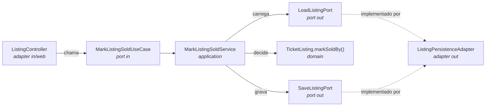

# Arquitetura Hexagonal

> [!important] Fonte da verdade é o [[CLAUDE]]
> Esta nota **explica e conecta ao domínio**; o contrato normativo — o que é proibido,
> o que é obrigatório — está em [[CLAUDE]] §1. Divergiu? O [[CLAUDE]] vence, e esta nota
> é que precisa ser corrigida.

## A ideia em uma frase

O domínio fica no centro e não conhece ninguém: nem banco, nem HTTP, nem Spring.
Tudo que é tecnologia entra e sai por **portas**, e cada tecnologia é um **adaptador** plugado nelas.

## Por que aqui

O domínio do Revende é feito de **regras**, não de CRUD: posse ([[RN-006 Apenas o dono altera o anúncio]]),
transição de estado ([[RN-007 Ciclo de vida do anúncio]]), preço ([[RN-004 Preço de revenda é livre]]).
Hoje essas regras estão espalhadas em `ListingService`, `SecurityConfig` e anotações de DTO —
não existe um lugar onde se leia o negócio inteiro, e nada disso é testável sem subir o Spring.

Ver [[ADR-0001 Adotar arquitetura hexagonal]].

## Anatomia de um caso de uso

A seta que importa: **o adapter aponta para a porta**, nunca o contrário.

## Onde cada regra vai morar

| Tipo de regra | Lugar | Exemplo |
|---|---|---|
| Invariante do agregado | `domain/model` | [[RN-007 Ciclo de vida do anúncio]], [[RN-006 Apenas o dono altera o anúncio]] |
| Orquestração / transação | `application/service` | [[UC-09 Publicar anúncio]] carregar evento + salvar |
| Formato de entrada | `adapter/in/web` (Bean Validation) | preço positivo, campo obrigatório |
| Consulta / filtro | `port out` + adapter | [[RN-008 Vitrine mostra apenas anúncios ativos]], [[RN-013 Busca de eventos por cidade ou nome]] |
| Quem pode chamar | `adapter/in/web` + domínio | [[RN-010 Quem pode cadastrar evento]] |

> [!tip] Teste do olfato
> Se uma regra de negócio só pode ser testada subindo o Spring ou o banco, ela está na
> camada errada. Ver [[Qualidade de Código]] §testes.

## Contextos

[[Contexto Identity]] · [[Contexto Catalog]] · [[Contexto Marketplace]]

Ordem de migração e mapa arquivo-a-arquivo em [[Mapa de Migração]].
