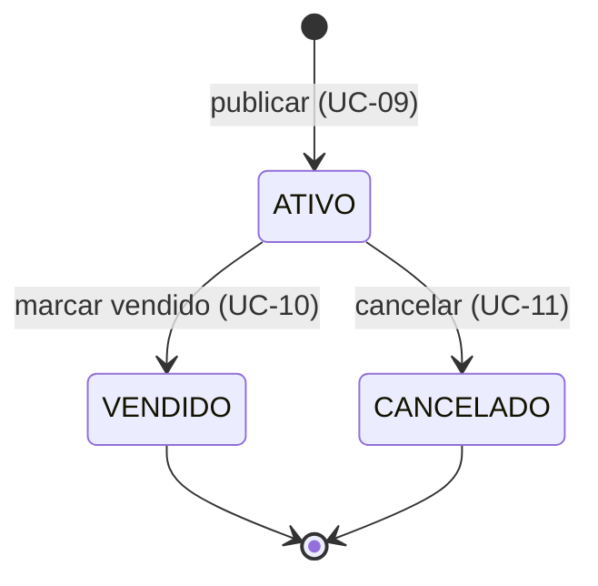

# Anúncio de Ingresso

`TicketListing` — a oferta de revenda de um **lote** de ingressos de um [[Evento]] por um
[[Usuário]]. Agregado raiz do [[Contexto Marketplace]].

## Atributos

| Campo | Tipo | Obrigatório | Nota |
|---|---|---|---|
| `id` | Long | gerado | |
| `event` | [[Evento]] | sim | `@ManyToOne` **EAGER** → N+1, dívida nº 6 |
| `seller` | [[Usuário]] | sim | `@ManyToOne` **EAGER** |
| `ticketType` | [[Tipo de Ingresso]] | sim | enum, gravado como `STRING` |
| `originalPrice` | BigDecimal | sim, > 0 | declarado, sem prova |
| `price` | BigDecimal | sim, > 0 | livre — [[RN-004 Preço de revenda é livre]] |
| `quantity` | Integer | sim, > 0 | default 1 — [[RN-009 Lote de ingressos é indivisível]] |
| `description` | String(1000) | não | texto do vendedor |
| `status` | [[Status do Anúncio]] | sim | nasce `ATIVO` — [[RN-005 Anúncio nasce ativo]] |
| `createdAt` | Instant | automático | não é exposto na API |

## Ciclo de vida



Detalhes e o furo atual em [[RN-007 Ciclo de vida do anúncio]].

## Comportamento alvo

Hoje toda decisão está em `ListingService`. No modelo hexagonal, o agregado responde por si:

```java
listing.markSoldBy(sellerId);   // valida posse (RN-006) + transição (RN-007)
listing.cancelBy(sellerId);
```

E as violações lançam exceção **de domínio** (`NotListingOwnerException`,
`IllegalListingTransitionException`), mapeadas para 403 e 409 na borda web.
Ver [[CLAUDE]] §1.4 item 5 e [[Arquitetura Hexagonal]].

## Regras aplicáveis

[[RN-004 Preço de revenda é livre]] · [[RN-005 Anúncio nasce ativo]] ·
[[RN-006 Apenas o dono altera o anúncio]] · [[RN-007 Ciclo de vida do anúncio]] ·
[[RN-008 Vitrine mostra apenas anúncios ativos]] · [[RN-009 Lote de ingressos é indivisível]] ·
[[RN-011 Anúncio exige evento existente]] · [[RN-012 Cancelamento é lógico]]
