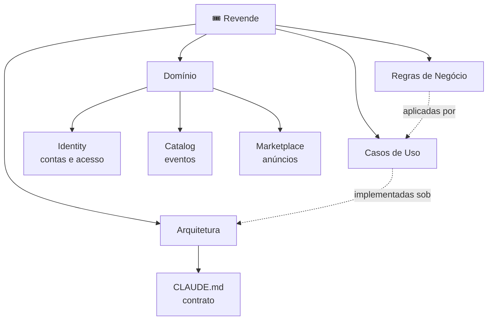

# 🎟️ Revende — Base de Conhecimento

Vault de domínio do **Revende**, marketplace de revenda de ingressos.
Abra a raiz do projeto (`revende-backend/`) como vault no Obsidian — assim as notas
conseguem linkar o [[CLAUDE]], que é o contrato de arquitetura e qualidade lido antes de toda task.

> [!important] Ordem de leitura antes de codar
> 1. [[CLAUDE]] — arquitetura hexagonal + padrão de qualidade (**obrigatório**)
> 2. A regra de negócio afetada, em [[Índice de Regras]]
> 3. O caso de uso afetado, em [[Índice de Casos de Uso]]

## Mapa

## Domínio

| Contexto | Do que cuida | Notas |
|---|---|---|
| [[Contexto Identity]] | Quem é a pessoa e se ela pode entrar | [[Usuário]] |
| [[Contexto Catalog]] | Que shows existem | [[Evento]] |
| [[Contexto Marketplace]] | Quem revende o quê, por quanto | [[Anúncio de Ingresso]], [[Status do Anúncio]], [[Tipo de Ingresso]] |

## Entradas principais

- 📕 [[Glossário]] — vocabulário único do projeto (ubiquitous language)
- 📜 [[Índice de Regras]] — 14 regras de negócio (RN-001…RN-014)
- 🎬 [[Índice de Casos de Uso]] — 11 casos de uso (UC-01…UC-11)
- 🧩 [[Arquitetura Hexagonal]] · [[Qualidade de Código]] · [[Mapa de Migração]]
- 📚 Base técnica: [[Hexagonal na prática]] · [[Desenho de Agregados]] · [[Modelagem PostgreSQL]] · [[Armadilhas do Spring Data JPA]]
- 🧾 [[Índice de Decisões]] — ADRs
- 🔥 [[Dívidas Técnicas]] — o que está torto hoje
- ❓ [[Perguntas em Aberto]] — o que ninguém decidiu ainda
- 💰 [[Business Model Canvas]] — modelo de negócio (board FigJam)
- 🗺️ `Revende.canvas` — visão espacial do domínio

## Como manter isto vivo

Toda task que muda comportamento atualiza a nota da regra correspondente **no mesmo commit**.
Regra nova → duplique [[Template - Regra de Negócio]]. Decisão estrutural → [[Template - ADR]].
Documentação desatualizada é pior que ausente: ela mente com autoridade.

## Legenda de status

`#implementada` fiel ao código · `#parcial` implementada com furo · `#ausente` decidida, não codada · `#proposta` ainda em discussão
