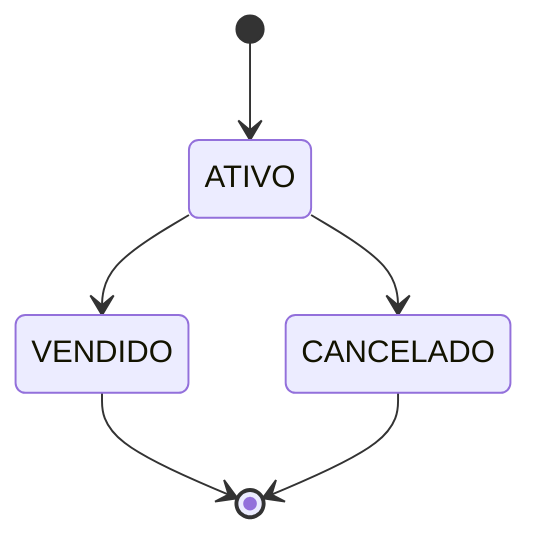

# RN-007 — Ciclo de vida do anúncio

> Um anúncio nasce `ATIVO` e vai **uma única vez** para `VENDIDO` ou `CANCELADO`.
> Os dois são estados **terminais**: dali não se sai.



## Por quê

"Vendido" é um fato histórico: desfazê-lo permitiria revender o mesmo ingresso.
"Cancelado" é desistência declarada: ressuscitar em silêncio confunde quem já viu a oferta sair.

## 🐞 Estado atual: **não validada**

`markSold` e `cancel` só checam posse ([[RN-006 Apenas o dono altera o anúncio]]) e
sobrescrevem o status. Hoje é possível:

- cancelar um anúncio e depois marcá-lo como **vendido**;
- marcar como vendido duas vezes;
- cancelar um anúncio já vendido, **apagando o registro da venda**.

Nada no código impede isso. É o furo de domínio mais grave do sistema.

## Correção alvo

A transição pertence ao agregado, não ao service:

```java
public void markSoldBy(SellerId requester) {
    requireOwner(requester);
    if (status != ATIVO) throw new IllegalListingTransitionException(status, VENDIDO);
    this.status = VENDIDO;
}
```

Estado inválido → **HTTP 409 Conflict**.

## Testes esperados

- ativo → vendido: ok · ativo → cancelado: ok
- vendido → cancelado: **409**, status preservado
- cancelado → vendido: **409**, status preservado
- vendido → vendido: **409**

Aplicada em [[UC-10 Marcar anúncio como vendido]] e [[UC-11 Cancelar anúncio]] ·
ver [[Status do Anúncio]].
